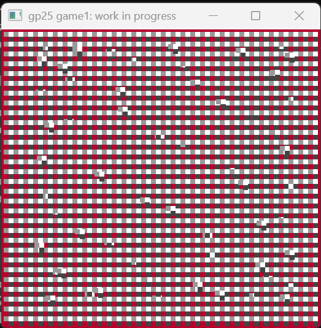

# Flyan cat

Author: Clytie Qiu

Design:
Partially inspired by Nyan cat-- guide a flying cat through obstacles.

Screen Shot: Base game sprites & palettes removed; PPU defaults shown.

How Your Asset Pipeline Works:

Run `node MaekfileAssets.js` to build the asset pipeline executable. Run pipeline.exe once with the desired PNGs listed in `assets.cpp` to translate them into game compatible PPU sprite files.

Tentative design:
`assets.cpp` restructures each PNG into 8x8 chunks, saves bit-planes sequentially (i.e. will read in this order: bit0 of the first tile, bit1 of the first tile, bit 0 of the second tile, bit 1 of the second tile,...), and creates new palettes as needed. It will not be shipped in `dist`.

The 8 (or less) Palettes will simply be 1x4 pix PNGs, saved (in processing) and loaded (in runtime) with load_save_png helpers.
The tilemap will be translated to bit-planes and saved/loaded in binary.

The developer must specify asset files in the runtime code. Note that the asset pipeline generates Palettes naively, without regard for the 8-Palette constraint imposed by the PPU.

How To Play:

Using the arrow keys, avoid obstacles for as long as possible.

This game was built with [NEST](NEST.md).

